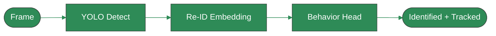

<!-- ════════════════════════════════════════════════════════════════
     ANIMATED HEADER — themed to livestock CV research.
     ════════════════════════════════════════════════════════════════ -->

<!-- HAND-WRITTEN DIAGRAM — your thesis as a flowchart. Rare in profiles. -->

*One shared backbone. Three tasks. My PhD thesis in a single diagram.*

---

## `whoami`

I'm a **PhD scholar in Electrical Engineering** (University of Gujrat) building a **Unified Multi-Task Deep Learning Framework for Precision Cattle Monitoring** — joint **detection · re-identification · behavior recognition** on one shared backbone.

By day I ship **Python** systems and tutor ML; by night I fight the **occlusion problem** and long-term identity preservation in animal tracking.

> *"Use AI as an accelerant — not a replacement for understanding."* — my teaching philosophy

---

<!-- TWO-COLUMN MAGAZINE LAYOUT via HTML table -->
<table>
<tr>
<td width="50%" valign="top">

### 🔬 Research

- 🐄 **Cattle face detection** with YOLOv8 *(published)*
- 🧬 **Synthetic data** generation in Unity for cow Re-ID
- 🎯 **Multi-object tracking** under occlusion
- 📡 Edge inference *(Jetson Orin Nano)*

</td>
<td width="50%" valign="top">

### 💼 What I Build

- 🐍 Python apps, automation & data pipelines
- 📊 Forecasting & analytics *(XGBoost, time-series)*
- 🤖 Computer vision & deep learning systems
- 🎓 ML & Python tutoring, beginner → advanced

</td>
</tr>
</table>

---

## 🧰 The Stack

---

<!-- COLLAPSIBLE SECTIONS — interactive, scannable -->

<b>📄 Publications & Research Output</b> (click to expand)

 

| Year | Work | Venue |
|------|------|-------|
| 2025 | Cattle Face Detection using YOLOv8 | *Published* |
| WIP  | Unified Multi-Task Framework for Cattle Monitoring | *In progress* |
| WIP  | Synthetic Data Generation for Cow Identification | *In progress* |

Targeting IEEE Transactions · Pattern Recognition · Computers and Electronics in Agriculture.

<b>🏅 Certifications</b>

 

- **Introduction to Data Analytics** — IBM
- **AI For Everyone** — DeepLearning.AI

<b>🎓 Currently Teaching</b>

 

Structured ML/Python curriculum on **Preply** and privately — Python → data viz → ML fundamentals → time-series forecasting → clustering, with hands-on projects.

---

## 📊 GitHub in Numbers

<!-- LIGHT/DARK AUTO-SWITCHING via <picture> — theme-aware -->

<picture>
  <source media="(prefers-color-scheme: dark)" srcset="https://github-readme-stats.vercel.app/api?username=eeumairali&show_icons=true&theme=dark&hide_border=true&icon_color=2E8B57&title_color=2E8B57" />
  
</picture>
<picture>
  <source media="(prefers-color-scheme: dark)" srcset="https://github-readme-streak-stats.herokuapp.com/?user=eeumairali&theme=dark&hide_border=true&ring=2E8B57&fire=2E8B57&currStreakLabel=2E8B57" />
  
</picture>

<!-- SNAKE ANIMATION — needs the GitHub Action (instructions below) -->

---

### 📫 Let's build something

**eeumairali@gmail.com** 

*Open to collaboration on Python & ML projects.*

